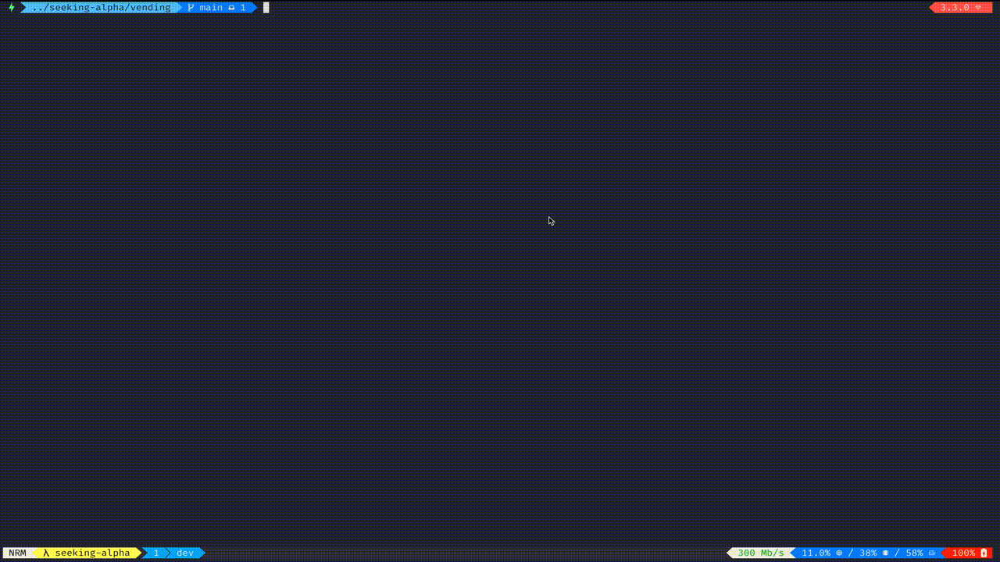

# Vending



## Installation

* Clone this repo
* Build docker image `docker build -t vending .`

## Usage

* Run CLI `docker run --rm -it vending` or run CLI in debug mode `docker run --rm -it vending bin/cli debug`
* Run inside console `docker run --rm -it vending bin/console`:
  ```
    machine = Vending::Machine.new

    products = machine.products
    product_id = products.first.id

    machine.add_coin!(label: '5')
    machine.add_coin!(label: '5')

    machine.purchase!(id: product_id)

  ```

## TODO

* [x] Once a product is selected and the appropriate amount of money (coins) is inserted return that product
* [x] Ask for more money (coins) if there is not enough
* [x] Manage the scenario where the item is out of stock
* [x] It should also return change (coins) if too much money is provided
* [x] Manage the scenario when machine does not have enough change
* [x] Change should be printed as coin * count and as minimum coins as possible
* [x] CLI
